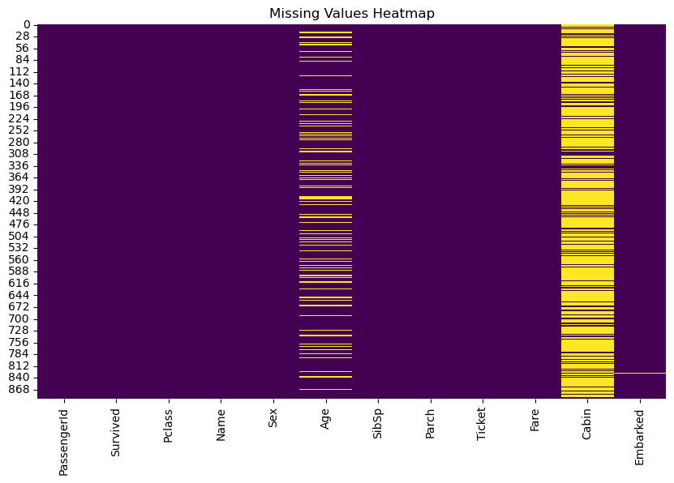
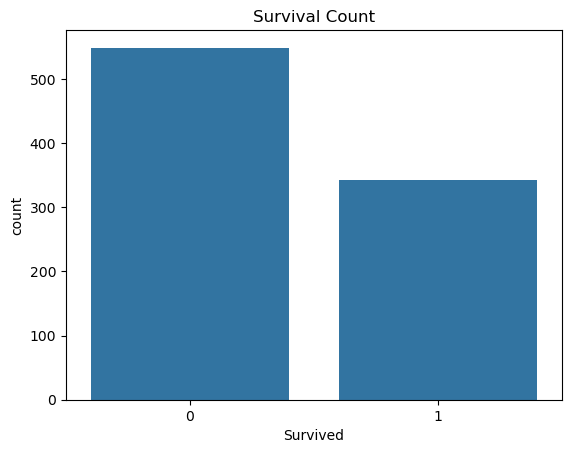
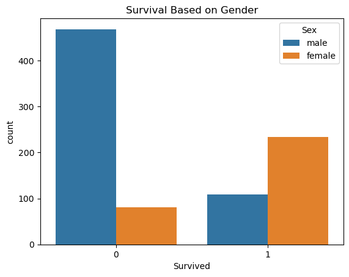
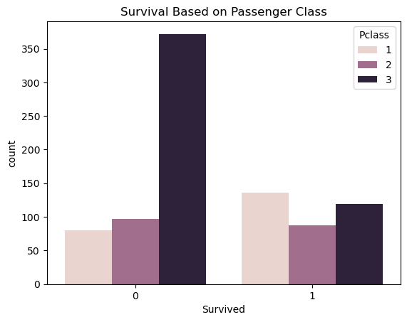
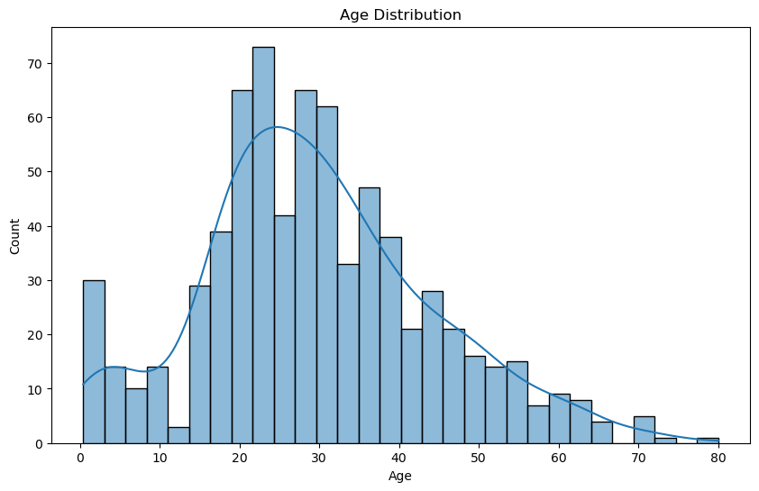
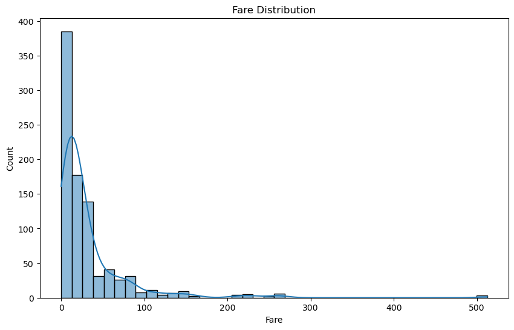
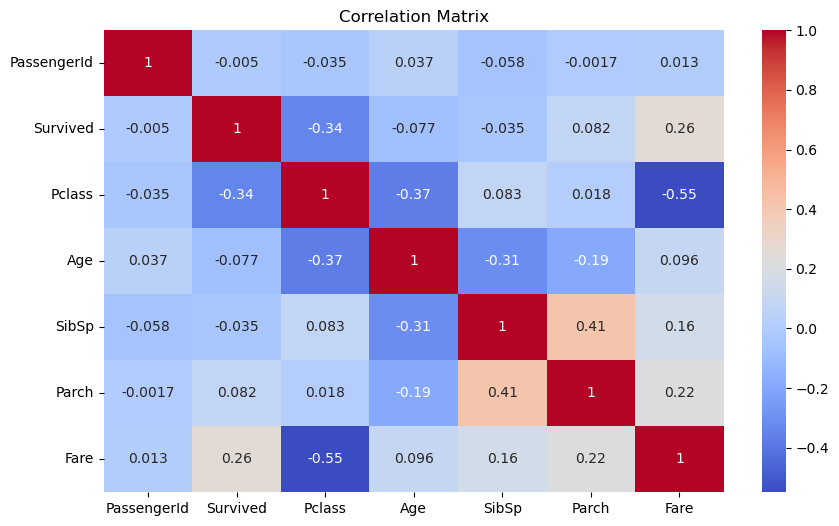
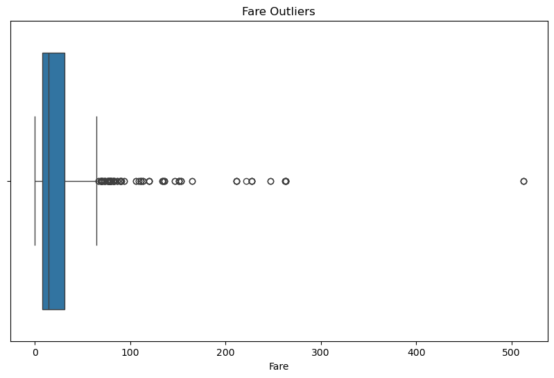

# 🚢 Titanic Dataset - Exploratory Data Analysis (EDA)

## 📌 Objective

The objective of this project is to perform Exploratory Data Analysis (EDA) on the Titanic Dataset to understand the factors that influenced passenger survival and gain insights through data visualization.

---

## 📂 Dataset Information

The Titanic dataset contains information about passengers onboard the Titanic, including:

- Passenger ID
- Survival Status
- Passenger Class
- Name
- Gender
- Age
- Fare
- Ticket Information
- Embarked Port
- Family Details

Dataset Size:

- Rows: 891
- Columns: 12

---

## 🛠️ Technologies Used

- Python
- Pandas
- NumPy
- Matplotlib
- Seaborn
- Jupyter Notebook

---

## 📁 Project Structure

```text
EDA-Titanic/
│
├── Titanic-Dataset.csv
├── Cleaned_Titanic_Data.csv
├── eda.ipynb
├── README.md
│
├── missing_values_heatmap.png
├── survival_count.png
├── gender_survival.png
├── class_survival.png
├── age_distribution.png
├── fare_distribution.png
├── correlation_matrix.png
└── fare_outliers.png
```

---

## 🔍 Exploratory Data Analysis Performed

### Data Exploration

- Examined dataset structure
- Checked data types
- Generated statistical summary
- Identified missing values

### Missing Value Analysis

Missing values found in:

| Column | Missing Values |
|----------|----------|
| Age | 177 |
| Cabin | 687 |
| Embarked | 2 |

### Data Cleaning

- Filled missing Age values using mean
- Filled missing Embarked values using mode
- Removed Cabin column due to excessive missing values
- Checked for duplicate records

### Visual Analysis

- Survival Count Analysis
- Gender-wise Survival Analysis
- Passenger Class Survival Analysis
- Age Distribution Analysis
- Fare Distribution Analysis
- Correlation Analysis
- Outlier Detection

---

## 📊 Key Insights

### Gender and Survival

- Female passengers had a significantly higher survival rate than male passengers.

### Passenger Class Impact

- First-class passengers had a greater chance of survival compared to second and third-class passengers.

### Age Distribution

- Most passengers were between 20 and 40 years old.

### Fare Analysis

- Fare distribution was highly skewed with several high-value outliers.

---

## 📈 Visualizations

### Missing Values Heatmap



### Survival Count



### Survival Based on Gender



### Survival Based on Passenger Class



### Age Distribution



### Fare Distribution



### Correlation Matrix



### Fare Outliers



---

## 📁 Output

The cleaned dataset generated after preprocessing:

```text
Cleaned_Titanic_Data.csv
```

---

## ▶️ How to Run

### Install Required Libraries

```bash
pip install pandas numpy matplotlib seaborn
```

### Run the Notebook

```bash
jupyter notebook eda.ipynb
```

---

## 🎯 Learning Outcomes

- Data Cleaning
- Missing Value Handling
- Exploratory Data Analysis
- Data Visualization
- Correlation Analysis
- Outlier Detection
- Data Interpretation

---

## 👩‍💻 Author

**Sadula Sarika**

Data Analytics Intern – CodeAlpha
