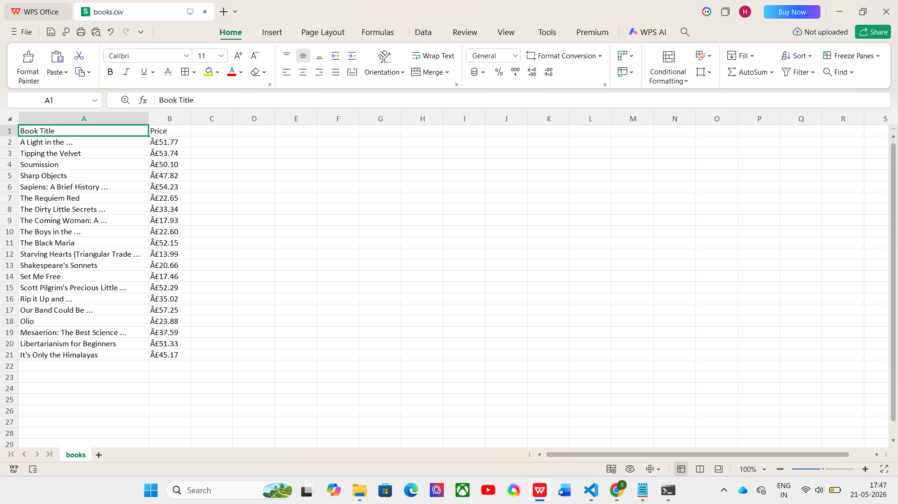

# 📚 Task 1 - Web Scraping Using Python

## 📌 Objective

The objective of this task is to scrape book information from the Books to Scrape website using Python and store the extracted data in a structured CSV file for further analysis.

---

## 🌐 Website Used

Books to Scrape

https://books.toscrape.com

---

## 🛠️ Technologies Used

- Python
- Requests
- BeautifulSoup (bs4)
- Pandas

---

## 📂 Project Structure

Task-1-Web-Scraping/
│
├── scraper.py
├── books.csv
├── output.png
└── README.md

---

## 🚀 Steps Performed

1. Sent an HTTP request to the website.
2. Parsed the HTML content using BeautifulSoup.
3. Extracted book details:
   - Book Title
   - Price
   - Rating
4. Stored the extracted data in a Pandas DataFrame.
5. Exported the data to a CSV file (`books.csv`).

---

## 📊 Output

The scraped dataset contains:

| Column |
|----------|
| Title |
| Price |
| Rating |

Sample Output:

| Title | Price | Rating |
|---------|---------|---------|
| A Light in the Attic | £51.77 | Three |
| Tipping the Velvet | £53.74 | One |
| Soumission | £50.10 | One |

---

## ▶️ How to Run

### Install Dependencies

```bash
pip install -r requirements.txt
```

### Run the Script

```bash
python scraper.py
```

After execution, a file named `books.csv` will be generated.

---

## 📷 Output Screenshot



---

## 🎯 Learning Outcomes

- Understanding Web Scraping concepts
- Working with HTML elements
- Extracting data using BeautifulSoup
- Data storage using Pandas
- Exporting data to CSV format

---

## 👩‍💻 Author

**Sadula Sarika**

Data Analytics Intern – CodeAlpha
